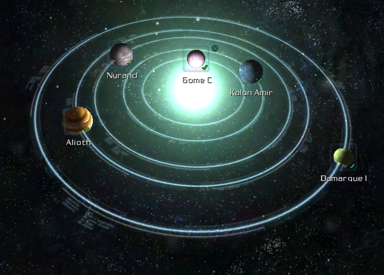
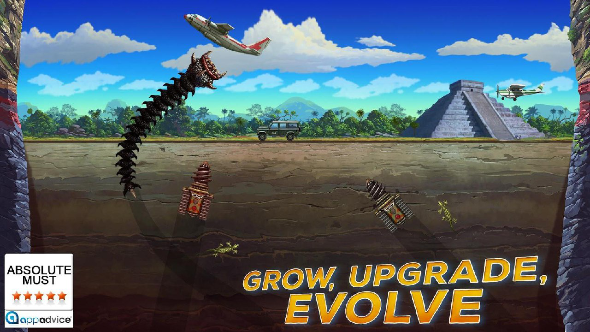
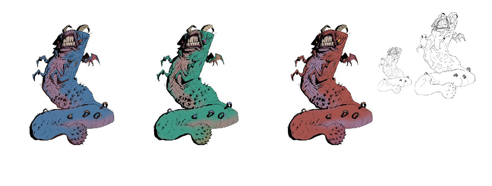
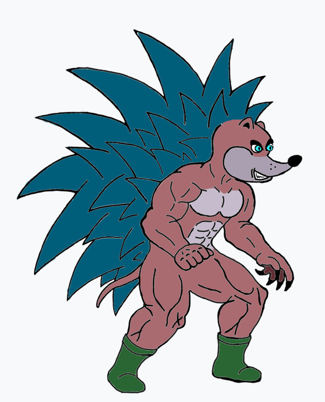

# **Team Z**

- # Game Genre

    Игра "Team Z" это 2D платформер в стиле old school с элементами битемапа, квеста, беготни и стрельбы. Игра таргетирована на управление геймпадом в лендскейпе. Целевые платформы: PC (рекоммендуется управление джойстиком), Xbox, Sony PS.

      Игра ориентирована на широкую аудиторию людей в основном взрослого возраста и мужского пола. Men > Women, 16+ age. Игра рассчитана больше на консольных игроков, чем на игроков на ПК. Дополнительный интерес эта игра вызовет у молодёжи 22-30 лет, имеющих опыт игры на консолях NES/SNES/SEGA в детстве. Так же эта игра будет привлекательна людям, имеющим слабое железо (ПК, старая консоль), так как будет нетребовательна к ресурсам.

- # Splash Screen

    Основной арт будет юзаться в качестве лоадинг скрина при старте игры и как один из элементов основного меню. На фоне ядерного гриба вверху - название игры Team Z большими буквами в стиле Duke Nukem.

    Основной арт
    
    Реферренс на текст названия
    

- # Main Menu

    Основное меню будет представлять страницу комикса из нескольких квадратных картинок, разного размера, каждая из которых будет пунктом меню. При запуске игры в меню отображаются только пункты NEW GAME, LOAD, SETTINGS и EXIT. При вызове меню во время игрового процесса добавляется пункт SAVE.

    - New Game
          Слегка видоизменённый основной арт без текста названия игры
    - Load
          Персонажи вылазят из криогенных камер в лаборатории
    - Save
          Персонажи залазят в криогенные камеры в лабораториях
    - Settings
          Персонажи разбирают космический корабль пришельцев или что-то в лаборатории
    - Exit
          Дохлые персонажи на обломках Земли

    Основное меню
      

- # UI

    Индикаторы жизни, брони, и дополнительных способностей в верхнем левом углу. Шкала должна быть не сплошной линией, а с делениями (каждое деление может быть в виде пикторгаммы, например сердечки в ряд), чтобы юзеру было удобнее видеть, сколько здоровья осталось до смерти. Поднимаемый предмет может быть один и должен отображаться в верхнем правом углу, там же могут отображаться какие-то дополнительные скиллы и мутации, которые могут происходить с персонажами.

- # World

    ## Design & Scenario

    В мире по сюжету будут остатки людей ученых и пришельцы. Начинается игра с Земли, с тайной лаборатории, где прячутся остатки людей. Пришельцы враги, люди не враги. Персонажи изначально нейтральны по отношению ко всем и могут атаковать всех. По мере прохождения персонажи узнают из обрывков сюжетных флешбеков инфу о предыстории этой войны, тайном эксперименте (в общем то что написано в сюжетной предыстории) по которой игрок может выбрать какой тактики ему придерживаться. От этого будет зависеть развитие мира. Чем больше убиваешь одних - тем сильнее другие. Со временем у тех кто сильнее появляются уникальные юниты и оружие. И они начинают захватывать новые локации за пределами Земли.
    
    Мир будет состоять из нескольких (3?) планет: Земля, родная планета пришельцев, и планета для колонизации, на которую переселятся остатки человечества в случае успешной концовки, или которая будет захвачена пришельцами в случае не успешной. Возможно 3 концовки: хорошая (спасение человечества) и 2 плохие (персонажи погибают, персонажи уничтожают всех). 

      Игровой процесс будет подталкивать игрока спасти Землю, но в конечном итоге игрок сам выбирает свой путь. Когда игрок убивает первого человека - цветовая гамма персонажей/левелов может немного поменяться на кроваво-красно-чёрную и показаться сообщение, о том что вы отклонились от своей миссии и это может плохо закончиться. 
     
    После каждого убийства человека цветовая гамма все сильнее и сильнее меняется, показываются комиксные катсцены и сообщения, что вы движетесь к хаосу.
     
    В итоге после нескольких убийств люди становятся врагами и хорошая концовка становится недоступна, остаётся только вариант уничтожить всех, или погибнуть самому. Для плохой концовки тоже будут миссии и сюжет, который завершится финальной катсценой.

      На каждой планете будет по несколько уровней, каждый из которых будет включать в себя несколько сцен. В мире по сюжету будут остатки людей (ученых, военных) и пришельцы черви-насекомые. Начинается игра с Земли, с тайной лаборатории, где прячутся остатки людей. И просыпаются главные герои.  Кроме Земли будут другие локации: родная планета Пришельцев, и несколько дополнительных планет. После выхода из лаборатории и прохождения всех уровней на Земле (финал - захват корабля пришельцев) - становится доступным космическая карта, на которой отмечены планеты, захваченные пришельцами и их родная планета. С помощью этой карты можно выбрать, куда двигаться дальше, и в зависимости от этого будут разные концовки.
    На карте будет отображаться, какие планеты в данный момент под контролем пришельцев, а какие под контролем людей. Пример карт: Galaxy on Fire, Bionic commander rearmed.

    Galaxy On Fire space map
    

    

    Bionic commander rearmed map
    

    ## Art

    Арт стиль игры по рисовке и цветам - будет похож на Comix Zone. Рисовка в комиксно-мультяшном стиле (Comix Zone (SEGA), Batman Forever (SNES), Batman Returns (SNES), Battletoads and double dragon (SNES), Alien 3 (SNES), Mark Of The Ninja (PC), Shovel Knight (NES), Бэтмен: нападение на аркхэм, Черепашки мутанты ниндзя: новые приключения. Катсцены, меню и диалоговые окна будут представлены в виде комиксов.

    ## Mechanics

    Аптечки, бронежилеты (силовая броня).

    У каждого персонажа будет удар рукой, ногой и один комбо удар (у ящерицы хвостом, у ежа скручивание в клубок и удар корпусом).

    На каждом уровне будет своё окружение и существа, которых можно будет жрать, и которые будут указывать выход из уровня (в лаборатории крысы, на поверхности мутировавшие птицы и ящерицы, в радиоактивных местах - тараканы).

    Ёж может подкинуть ящерицу. Ёж может подкидывать и ломать тяжелые предметы, которые не может ящер.

    Ящер может лазить по решёткам, стенам.

    Ящерица может отбросить хвост, а ёж подберёт, сожрёт и подлечиться (доступно 1 раз в длительный промежуток времени, после этого ящерица долго не может бить хвостом).

    Капсулы с мутагеном, который временно немного усиливает и видоизменяет персонажей.

    Будут уровни с высоким и низким уровнем радиации. На уровнях с высоким уровнем радиации (поверхность Земли, за пределами лаборатории) у персонажей будет медленно отниматься здоровье, что будет подталкивать к поиску аптечек и капсул с мутагеном.

    Будут уровни с разной направленностью: уровни в которых нужно будет двигаться слева направо, справа налево, вверх и вниз. 

    Будут уровни с несколькими выходами. От того, с какой стороны выйдешь будет зависить насколько тяжело будет пройти уровень и убить врагов. Но при игре вдвоём выйти можно будет только в один вместе.

    ## Enemies

    Турели, боевые дроны (летающие, бегающие, ездящие), лазеры, мины, и другие защитные системы, автоматические защитные роботы - мини танки. 

    Червеобразные высокоразвитые насекомые паразиты, питающиеся белком. Разнообразные типы пришельцев: ползающие, прыгающие со стен и потолка, пробивающие пол и стены, стреляющие.

    Примеры арта: 
     
     
    
    
    
    

    ## Characters

    - ## Lizard

        

        Продукт генной мутации, суперсолдат. Быстрый, сильный, ловкий, бесшумный. Толстая кожа невосприимчива к повреждениям и интенсивному воздействию различными типами лучей. Слабо восприимчив к радиации. Видит в темноте, видит в инфракрасном спектре. Может лазить по лестницам, решеткам, стенам (если есть за что зацепиться). Высоко прыгает и быстро бегает (временное ускорение на короткие дистанции). Может пролазить в вентиляционные и канализационные люки, лазить по вентиляции. Может использовать стелс мод (сливаться с окружением). Техника ведения рукопашного боя построена на основе капоэйры.

        Удары:
        - Боковой удар открытой рукой - когтями (галопанч, или боковой удар ладонью)
        - Удар ногой сбоку (мартела - прямой высокий удар голеностопом в голову или тело сбоку)
        - Удар хвостом с разворотом и опором на руку (миа луа де компассо) - комбо удар, наносит больше урона
        - Двойной удар ногой, а затем хвостом с разворота (армада) - комбо удар, наносит больше всего урона, медленнее чем остальные удары

        Анимация покоя

        Анимация бега

        Анимация прыжка (с отталкиванием хвостом от земли)

        Анимация ползанья по стенам

        Анимация подкрадывания

        Анимация приседания

        Анимация смерти

        Удар рукой на ходу

        Удар рукой в прыжке

        Удар ногой в прыжке

        Анимация взаимодействия с объектом (на стене/на полу)

    - ## Hedgehog

        

        Продукт генной мутации, суперсолдат. Аномально сильный, живучий, выносливый и тяжёлый. Способен выдерживать большие нагрузки и перегрузки. Слабо восприимчив к радиации. Видит в темноте. Толстая кожа и броня из игл делает его практически неуязвимым для легкого вооружения. Из-за этого значительно медленнее чем ящер. Слабо прыгает. Бъёт в основном руками. Медленно ходит, но может не на долго ускоряться. Может поднимать и кидать тяжёлые предметы, может ломать ящики и другие объекты уровня, может выламывать двери и решетки. Может лазить по лестницам, но не может по решеткам и стенам. Техника ведения рукопашного боя построена на основе бокса и муай тай.

        Удары:
        - Прямой удар кулаком (джеб)
        - Боковой удар кулаком или когтями (хук) 
        - Удар локтем сверху вниз (сок саб)
        - Удар коленом снизу вверх (као лой) - комбо удар, наносит больше урона
        - Удар с разгона плечом, скручиваясь в клубок и выставляя вперёд иглы - самый мощный комбо удар, может ломать преграды

        Анимация покоя

        Анимация шага

        Анимация бега

        Анимация прыжка

        Анимация блока

        Анимация приседания

        Анимация смерти

        Удар рукой на ходу

        Удар рукой в прыжке

        Удар коленом в прыжке

        Анимация взаимодействия с объектом (на стене/на полу)

- # Level 1

    - # Flow

        - Базовое обучение (0%)
            - Пройтись вперед
            - Осмотреться, подобрать аптечку, энергощит
            - Открывать ящики, найти что-то еще полезное
            - Уровень уходит вверх нужно запрыгывать уступы
            - Препятсвие ввиде стены ящиков, которую нельзя перепрыгнуть
                - ящер может обойти ее по сетке
                - еж разрушить ящики
            - Лазить по разным уровням лаборатории

        - Далее долгий коридор в котором раставленно старое обурудоваение с которым можно взаимоедйствовать. Оно что-то пиликает при включениие и выдает сюжетные катсцены-комиксы, которые объясняют сюжет, потом отключется. Если пройти немного дальше, то сверху отвалится решетка. Которая упадет на голову герою (10%)
            - Ящер заверещит от боли
            - Еж просто скажет "ауч"

        - Герои видят перед собой дверь которая блокирует доступ к  следующей комнате (20%)
            - Ящер может пролезть сквозь вентиляцию и открыть дверь с той стороны.
            - Еж может разбить железные ящики и достать от туда ломик из HL2. Им он может выламать дверь и войти во внутрь.
        Переход на вторую сцену (Level 1. Stage 2. Through the catacombs).

        - Level 1. Stage 2. Through the catacombs. Герои попадают в длинный коридор подземной лаборатории. Видно что люди в спешке покидали базу, отступали с боем, везде куча мусора, валяются ящики, оружие, трупы. Впереди видно баррикады и ловушки которые оставили люди когда отступали (30%). 
            - Герои находят капсулу с мутагеном, которая усиливает их
            - Внеше немного видоизменяются. Открывается меню со скилами по виду напоминающее Level Up из Героев Меча И Магии 3. Предлагается 2 улучшения на выбор.
            - Здесь появляются первые турели. Героям нужно их отпиздить или обойти
            - Ящер может попытаться обходить их со спины при помощи решеток.
            - Еж подбирать ящики и бросать в них.
            - Появляются мины, которые нужно обходить/перепрыгивать/перелазить
            - Появляются летающие дроны и роботы защитники

        - ... (40-80%)
            
        - Герои доходят до центрального командного пункта лаборатории, объединяются с людьми, получают указания, новые таски и улучшения, и отключают системы защиты лаборатории (90%).

        - Герои проходят по лаборатории с отключёнными системами защиты и выходят на поверхность Земли. Мощные двери лаборатории за ними закрываются и системы защиты снова включаются. Дальше предстоит зачистить Землю от пришельцев и захватить их космический корабли, чтобы отправиться на их родную планету (100%).

    - # Stage 1. Laboratory. Initializing protocol

        ## Design

        Большая подземная лаборатория. Выглят заброшенной, много оборудывания,компьютеры, криогенные камеры открыты, ящики с боеприпасами, аптечки и бронежилеты, ящики разрушаемые и не разрушаемые, железные ящики с чем-то внутри, бочки. Освещение тусклое от ламп которые мигают. 
        На стенах решетки по которым можно лазить. Над ними вентиляционные решетки.
        Лаборатория несколько уровневая и из нескольких комнат. Есть лестницы по которым можно залезть на решетки и на другие этажи. Двери в комнату через которую идет проход на следующий уровень не работают. В стене над дверью вентиляционная решетка, через которую ящер может пролезть в комнату и перейти на следующий уровень, либо открыть дверь ежу при игре вдвоем. При игре за ежа - ёж разламывает железный ящик, подпирает лом и ломает дверь и проходит на следующий уровень.

        ## Art

        Бекграунд: пол, стены лаборатории, потолок, лампы, столы, ящики, мебель, оборудование, электроника с которой нельзя взаимодействовать, капсулы.

        Средний уровень: деревянные ящики, которые можно двигать и разрушать, деревянные ящики которые нельзя разрушать, железные ящики разрушаемые/неразрушаемые, аптечки, броники (энергощиты), лестницы и переходы, двери,сетка на стенах, вентиляционные решетки, вентиляционная шахта, электроника с которой можно взаимодействовать.

        ## Scenario

        - ### Common

            На первом уровне первой сцене идет обучение геймплею и показываются основные игровые механики. Персонажи могут бегать по сцене, прыгать, приседать, разрушать и двигать деревянные ящики, двигать железные ящики и бочки, лазить по лестницам, подбирать предметы (аптечка, бронижилет), взаимодействовать с аппаратурой и читать сюжетные подсказки.
            Цель - исследовать сцену, обучиться, узнать о сюжете и выбраться из лаборатории - перейти на следующую сцену.
            Если игрок долго не может найти выход с уровня - то рандомно ящер выдает подсказку "посмотри, а что это там вверху", а ёж "возможно в этих ящиках есть что-то полезное".
            В каждом уровне в начале и/или в конце будет буферная зона, которая позволит ознакомиться с окружающим миром (не долго, примерно 10с). В это время будут происходить какие-то ивенты. Например на 1 сцене 1 левела может упасть решетка с вентиляционного люка, ёж может провалиться ногой в люк.

        - ### Lizard

            Слабее чем ёж. Может ползать по решеткам. Бегает и бьёт быстрее. Может приседать. Может пролазить через вентиляцию.

        - ### Hedgehog

            Сильнее, больше хп и больше урон. Не может ползать по решеткам. Бегает медленнее. Может разбить железные ящики и достать от туда что-то. Может бросать железные и деревянные ящики.

        ## Mechanics

        На уровнях могут быть нейтральные существа, которые могут показывать направление и которых можно жрать. Они будут отличаться на разных уровнях и могут повлиять на персонажей.

        ## Enemies

        На самом первом уровне (Stage 1. Laboratory. Initializing protocol) не будет врагов. Весь уровень - буферная зона на которой можно осматриваться, знакомиться с миром, обучаться. Цель - найти выход.

- # Level 1

    - # Stage 2. Through the catacombs.

        ## Design

        ## Art

        ## Scenario

        ## Mechanics

        ## Enemies